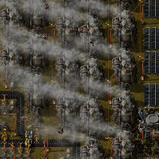

# Bob's & Angel's Proper Pollution

Have you ever wondered why Bob/Angel mid/late game with biters is so easy? Then this mod is made exactly for you! The aim of this mod is to change espacially Bob's energy entities like Boilers and Mining Drills which have **MASSIVELY** reduced pollution production at higher tiers.

# TL;DR

In early game (espacially Death World) the biters keep coming and you need to be on your toes. In later stages of the game, as you upgrade your Boilers/Miners and use modules, you get to the point when you generate almost no pollution and biter attacks basically disappear.
This mod significantly reduces the reduction in pollution for miners/boilers which creates much more consistent experience. You are still rewarded with slight reduction for every new tier you build.

# Examples

Example:
- Mining Drill (Tier 1) has 0.5/s (30/m) mining speed, 10/m polluton and 90kW consumption.
- Mining Drill (Tier 5) has 8.0/s (480/m) mining speed, 2/m polluton and 1.1MW consumption.

So the Tier 1 mining drill generates 0.33 pollution per ore mined, while Tier 5 generates 0.004167 pollution per ore mined, that's **80** times lower.

Of course we need to factor in the energy consumption, which is ~12 times higher. So let's dig into boilers:
- Boiler (Tier 1) produces 1.8 MW of energy at 30/min pollution
- Boiler (Tier 5) produces 9 MW of energy at 9.38/min pollution or 1.8 MW of energy at 1.876/min pollution, which is **16** times less

Even though the Mining Drill (Tier 5) consumes 12 times more energy than Tier 1, it costs 16 times less pollution to produce that energy with Boiler 5.

Let's add the pollution from energy generation to the equation:
- Mining Drill (Tier 1) -  0.5/s (30/m) mining speed, 10/m + 1.5/m from Boiler 1 = 11.5/m pollution => **0.38333333 pollution per ore mined**
- Mining Drill (Tier 5) - 8.0/s (480/m) mining speed, 2/m + 0.23/m from Boiler 5 = 2.23/m pollution => **0.00464583 pollution per ore mined**

All summed up, Mining Drill (Tier 5) produces more than **82.5** times less pollution than Mining Drill (Tier 1) per ore mined.

Since mining & energy generation account for overwhelming majority of pollution AND higher tier biters need more pollution to spawn than small biters, this causes the attacks on your base to taper off in the mid/late game even with crazy Death World settings.

## **Bob's & Angel's Proper Polution** mod to the rescue

Energy generators, reactors and miners now have growing pollution with each tier (it grows slower and slower with higher tiers so the incentive to upgrade is still there).

Let's redo the same example with modded pollution.
- Mining Drill (Tier 1) - unchanged (10/m pollution, 0.5/s mining speed, 90kW consumption)
- Mining Drill (Tier 5) - 83.59/m pollution, rest unchanged (8/s mining speed, 1.1MW consumption)
- Boiler (Tier 1) - unchanged (30/m pollution, 1.8MW)
- Boiler (Tier 5) - 91.521/m pollution, rest unchanged (9MW)

Let's calculate Boilers first:
- Boiler (Tier 1) produces 1.8 MW of energy at 30/min pollution
- Boiler (Tier 5) produces 9 MW of energy at 91.521/min pollution or 1.8 MW of energy at 18.31/min pollution, which is 61% of Boiler Tier 1 or **1.64 times** less

And now the miners:
- Mining Drill (Tier 1) has 0.5/s (30/m) mining speed, 10/m + 1.5/m from Boiler 1 = 11.5/m pollution => **0.38333333 pollution per ore mined** (unchanged)
- Mining Drill (Tier 5) has 8.0/s (480/m) mining speed, 83.59/m + 11.19/m from Boiler 5 = 94.78/m pollution => **0.197457 pollution per ore mined**

That's 51.5% of Tier 1 or **1.94** times less.

Enjoy!

# Playtesting

Tested with Death World setting (300%/300% nests)

Bob's Enemies settings:
- Super spawners - enabled
- Health Increase - enabled
- Bigger enemies soooner - enabled

Bob's Modules settings:
- God modules - disabled
- Green modules - disabled
- Pure productivity modules - disabled
- Pure speed modules - disabled

Bob's Metals, Chemicals and Intermediates settings:
- Expensive electrolysis - enabled

# Special thanks

To [Bobingabout](https://mods.factorio.com/user/Bobingabout) & [Arch666Angel](https://mods.factorio.com/user/Arch666Angel) for creating these amazing mods.

